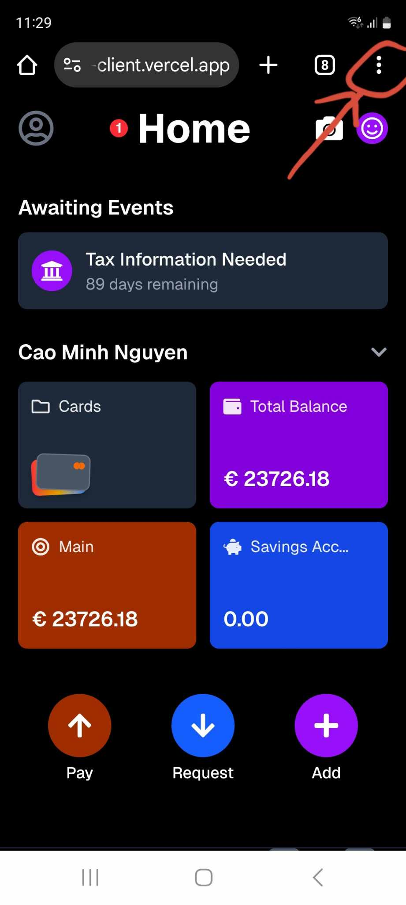
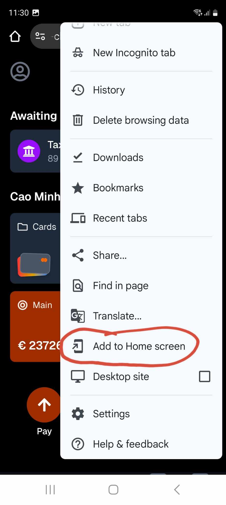

This is the instruction for running the client of our Progressive Web App.

1. Clone the Repository.
```bash
git clone https://github.com/JordanGallant/bunq-client.git
cd bunq-client
```

2. Install all the dependencies. 
Make sure you have Node.js, then run:
```bash
npm install
```
3. Start the development server
```bash
npm run dev
```
The app will be available at http://localhost:3000.

4. Open the app on your mobile phone

- We have deployed the client using Vercel.

- Open any browser on your phone (like Chrome or Safari).
Type in the URL: https://bunq-client.vercel.app to open the app on the browser.

- To open the web application as an app on your phone, click on the three dots on the top right of your browser, then choose <i>Add to Home screen</i>, then click <i>Install</i>.




An app with the bunq logo will be installed on your phone and you can open it to use the web application.